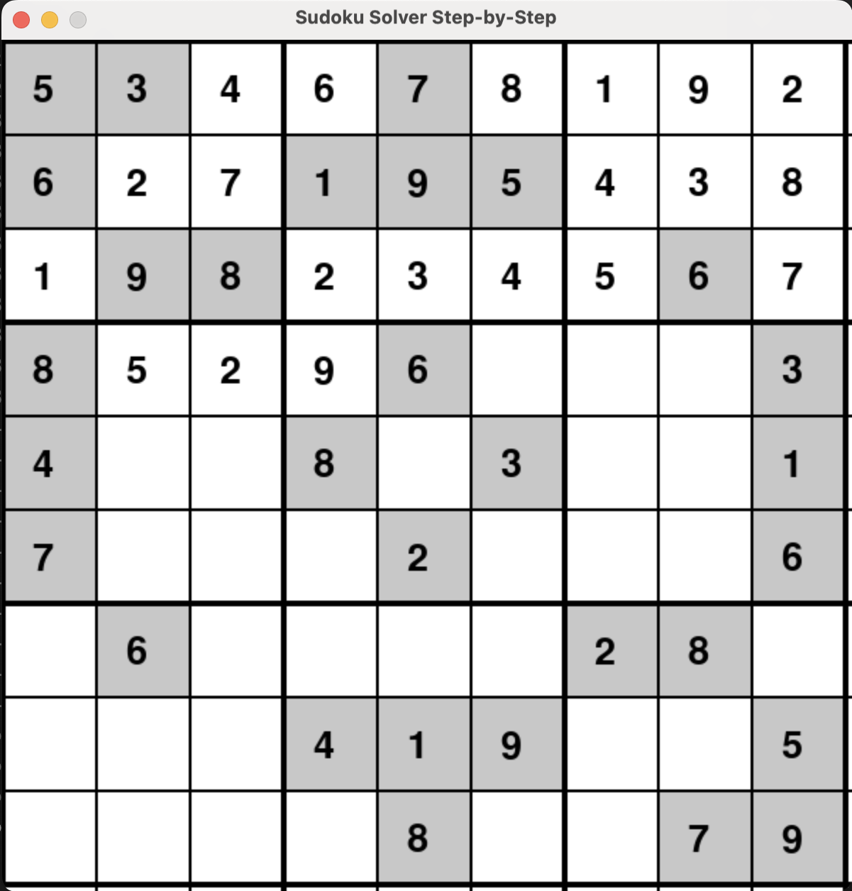

# Sudoku Solver

A Python program that solves a Sudoku puzzle step-by-step using backtracking, and visualizes the solution using the `pygame` library. The solver shows each step of the backtracking process, updating the board and highlighting the state of the cells.

## Features

- Solves Sudoku puzzles step-by-step.
- Visualizes the solving process using the `pygame` library.
- Highlights correct, incorrect, and fixed cells with different colors.

## Requirements

To run this project, you need to have the following Python libraries installed:

- `pygame`: For graphical user interface and rendering the Sudoku board.

You can install the dependencies by running:

```bash
pip install -r requirements.txt
```

## How to Run

1. Clone the repository to your local machine:

   ```bash
   git clone https://github.com/alinjfz/sudoku_solver.git
   cd sudoku-solver
   ```

2. Install the required dependencies:

   ```bash
   pip install -r requirements.txt
   ```

3. Run the Sudoku solver script:

   ```bash
   python sudoku_solver.py
   ```

The program will open a graphical window that displays the Sudoku puzzle being solved step-by-step.

## Example


